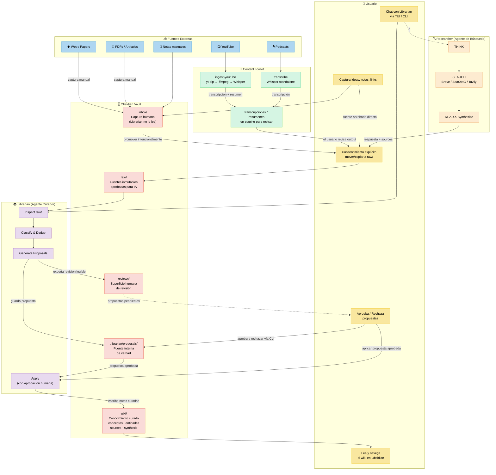

# 🧠 Ecosistema Segundo Cerebro

Una guía completa y para principiantes para armar tu propio Segundo Cerebro — desde cero hasta un sistema de conocimiento confiable, con una capa de IA opcional.

> **Prefer to read in English?** → [README.md](./README.md)

---

## ¿Qué es un Segundo Cerebro?

Un Segundo Cerebro es un sistema de gestión de conocimiento personal que te ayuda a capturar, organizar y recuperar todo lo que aprendés, pensás y creás. En vez de depender de tu memoria, descargás la información en un sistema externo en el que confiás.

El concepto fue popularizado por [Tiago Forte](https://fortelabs.com/) y su metodología **BASB** (Building a Second Brain), pero no necesitás seguir ningún framework específico para empezar.

## Lore

Necesitaba resolver un problema concreto: **el manejo de la información dentro de mi PC**.

Empecé creando una biblioteca virtual para todo lo que me llamaba la atención — conocimiento técnico, libros, podcasts, resúmenes de videos de YouTube. Quería armar mi propia biblioteca de conocimiento, curada y organizada.

Todo empezó con el [gist de Karpathy sobre LLM Wiki](https://gist.github.com/karpathy/442a6bf555914893e9891c11519de94f). Se me ocurrió hacer un segundo cerebro. Al principio fueron dos carpetas con archivos `.md` escritos a mano. Funcionaba, pero eventualmente manejarlos se volvía complicado: links rotos, notas duplicadas, contenido desactualizado, ideas huérfanas.

Así que decidí **automatizar mi Second Brain**.

Armé un chat donde le pido a mi LLM local, a través de mi agente, que mantenga la biblioteca. Me di cuenta de que quería resúmenes completos de videos de YouTube, así que armé un pipeline de transcripción. No quería cualquier resumen, así que creé skills con métodos científicos de resumen. Y me di cuenta de que la biblioteca necesitaba corroboración — información faltante que mi agente no podía llenar solo. Así que creé Researcher, otro agente que encuentra lo que falta y lo complementa.

Está en alpha. Puede tener bugs. Pero ya es útil.

---

## Arquitectura

> 📖 Documentación completa de arquitectura: [`docs/architecture/ARCHITECTURE.md`](./docs/architecture/ARCHITECTURE.md)

## ¿Qué tiene este ecosistema?

| Proyecto | Descripción | Estado |
|----------|-------------|--------|
| **[Landing Page](./index.html)** | Landing page visual y bilingüe del proyecto — hosteada en GitHub Pages | 🟢 Live |
| **[second-brain](./second-brain/)** | Guía paso a paso para armar tu Segundo Cerebro desde cero usando Obsidian — incluye 7 guías bilingües, 7 templates iniciales y un brief para agentes | 🟢 En progreso |
| **[local-LLM](./local-LLM/README.es.md)** | Guía opcional para correr un modelo local con Ollama para Librarian | 🟢 En progreso |
| **[librarian](https://github.com/Agents4Life/librarian)** | Agente de mantenimiento de conocimiento review-driven para vaults de Obsidian | 🟡 Alpha experimental |
| **[content-toolkit](https://github.com/VanessaPellegrini/content-toolkit)** | Herramientas de ingesta de medios — YouTube → transcripción → resumen, Whisper standalone | 🟢 Listo |
| **[researcher](https://github.com/Agents4Life/researcher)** | Búsqueda web agéntica (patrón Search-o1) — piensa, busca, lee, sintetiza | 🟡 Alpha experimental |

## Empezá acá

**Probá la landing page primero:** Abrí [index.html](./index.html) en tu navegador para una vista visual del ecosistema, o visitá la deployment en GitHub Pages.

### ¿Nunca armaste un Segundo Cerebro?

Entrá en **[second-brain/](./second-brain/)** y seguí las guías en orden:

1. **[¿Qué es un Segundo Cerebro?](./second-brain/guides/es/01-what-is-second-brain.md)** — Conceptos clave y por qué necesitás uno
2. **[Aplicaciones que vas a necesitar](./second-brain/guides/es/02-apps-you-need.md)** — Herramientas y descargas
3. **[Configurar Obsidian](./second-brain/guides/es/03-setting-up-obsidian.md)** — Instalación y primer vault
4. **[Estructura del Vault](./second-brain/guides/es/04-vault-structure.md)** — Cómo organizar carpetas y notas
5. **[Plugins esenciales](./second-brain/guides/es/05-essential-plugins.md)** — Plugins comunitarios imprescindibles
6. **[Tu flujo de trabajo](./second-brain/guides/es/06-workflow.md)** — Capturar → Organizar → Recuperar → Crear
7. **[Siguiente nivel con IA](./second-brain/guides/es/07-next-level-with-ai.md)** — Automatización y enriquecimiento opcionales con Librarian
8. **[Configurar un LLM local](./local-LLM/README.es.md)** — Configuración local opcional de Ollama para Librarian
9. **[Inicio rápido para agentes](./second-brain/guides/agent/README.md)** — Orden de lectura mínimo y reglas de edición para agentes de IA

### ¿Ya tenés un Segundo Cerebro?

Si querés asistencia con IA, probá **[librarian](https://github.com/Agents4Life/librarian)** para sumar una capa de agente opcional a tu vault.

## Templates

El ecosistema incluye 7 templates iniciales de Obsidian en [`second-brain/templates/`](./second-brain/templates/):

| Template | Para qué |
|----------|----------|
| `daily-template.md` | Nota diaria con foco, notas, ideas y capturas |
| `weekly-review.md` | Revisión semanal con limpieza de inbox, revisión de proyectos y planificación |
| `source-template.md` | Nota de fuente general con URL, autor y tags |
| `raw-source-template.md` | Fuente movida a `raw/` para procesamiento de Librarian |
| `wiki-concept-template.md` | Página de concepto de Librarian (capa wiki) |
| `wiki-source-template.md` | Página de índice de fuente de Librarian (capa wiki) |
| `wiki-synthesis-template.md` | Página de síntesis de Librarian (capa wiki) |

## Filosofía

- **Empezá simple** — No necesitás 50 plugins el primer día
- **Primero los hábitos** — El sistema solo funciona si lo usás consistentemente
- **Iterá** — Tu Segundo Cerebro evoluciona con vos
- **Tus datos son tuyos** — Todo vive en archivos Markdown en tu máquina (cuando usás proveedores locales como Ollama, las notas se quedan locales; los proveedores cloud pueden recibir fragmentos relevantes según la configuración)

## ¿Para quién es?

- 🧑‍💻 Developers que quieren organizar su aprendizaje
- ✍️ Escritores y creadores de contenido
- 📚 Estudiantes y aprendices permanentes
- 🏢 Profesionales que manejan mucha información
- 🤖 Cualquiera curioso sobre gestión del conocimiento con asistencia opcional de IA

## Contribuir

Este proyecto está en etapas tempranas. ¡Contribuciones, sugerencias y traducciones son bienvenidas!

## Estado Actual

Librarian actualmente es:
- review-driven — todos los cambios requieren aprobación humana vía CLI
- manualmente disparado — sin procesos automáticos ni en background
- proposal-based — las mutaciones pasan por un ciclo de proponer → revisar → aprobar → aplicar
- software alpha experimental

## Dirección Futura

Capacidades planificadas:
- indexación incremental
- filesystem watchers
- loops de mantenimiento autónomo
- sistemas de recovery y reconciliación

Ninguna de estas está implementada todavía. La documentación describe el comportamiento actual salvo que se marque explícitamente como planificado.

## Licencia

MIT

---

**Idiomas:** [English](./README.md) · [Español](./README.es.md)
