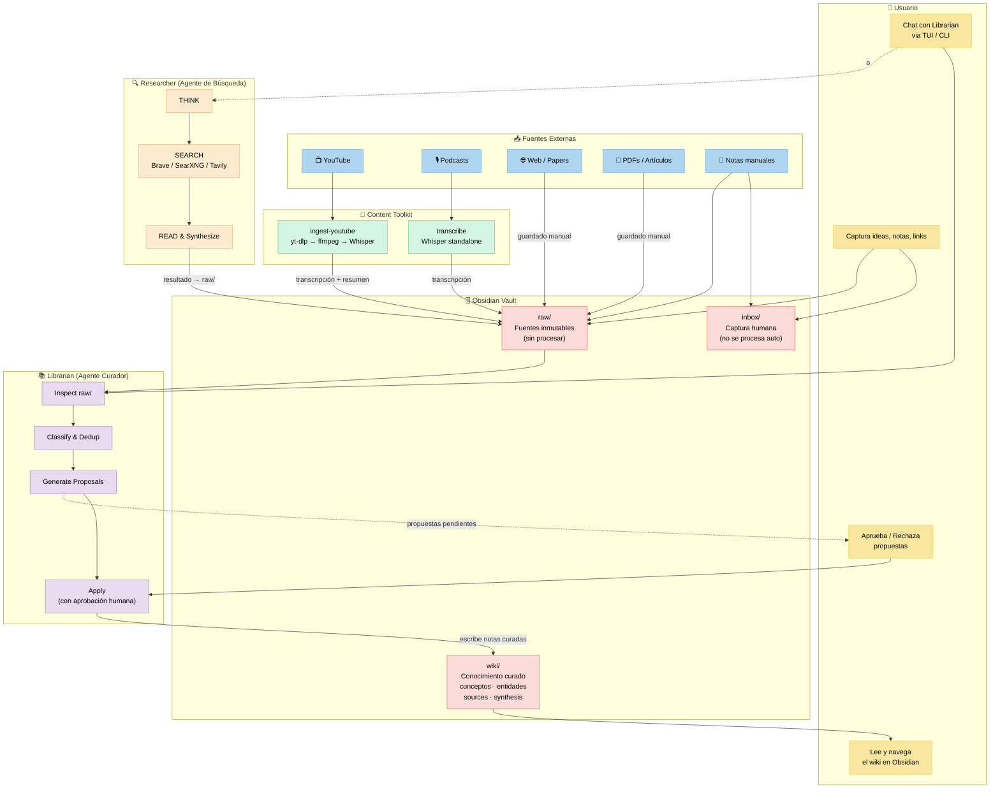

# 🧠 Second Brain Ecosystem

A complete, beginner-friendly guide to building your own Second Brain — from zero to a reliable knowledge system, with an optional AI layer.

> **¿Prefieres leer en español?** → [README.es.md](./README.es.md)

---

## What is a Second Brain?

A Second Brain is a personal knowledge management system that helps you capture, organize, and retrieve everything you learn, think, and create. Instead of relying on your memory, you offload information into a trusted external system.

The concept was popularized by [Tiago Forte](https://fortelabs.com/) and his **BASB** (Building a Second Brain) methodology, but you don't need to follow any specific framework to get started.

## Lore

I needed to solve a concrete problem: **managing all the information on my PC**.

It started with the [LLM Wiki gist by Karpathy](https://gist.github.com/karpathy/442a6bf555914893e9891c11519de94f). I wanted a second brain — at first, just two folders with hand-written `.md` files. It worked, but eventually managing them became complicated: broken links, duplicate notes, stale content, orphaned ideas.

So I decided to **automate my Second Brain**.

I built a chat where I ask my local LLM, through my agent, to maintain my library. I realized I wanted full summaries of YouTube videos, so I built a transcription pipeline. I didn't want just any summary, so I created skills based on scientific summarization methods. And I realized my library needed corroboration — information gaps that my agent couldn't fill alone. So I built Researcher, another agent that finds what's missing and fills in the blanks.

It's in alpha. It may have bugs. But it's already useful.

---

## Architecture

> 📖 Full architecture documentation: [`docs/architecture/ARCHITECTURE.md`](./docs/architecture/ARCHITECTURE.md)

## What's in this ecosystem?

| Project | Description | Status |
|---------|-------------|--------|
| **[Landing Page](./index.html)** | Visual, bilingual landing page for the project — hosted on GitHub Pages | 🟢 Live |
| **[second-brain](./second-brain/)** | Step-by-step guide to set up your Second Brain from scratch using Obsidian — includes 7 bilingual guides, 7 starter templates, and an agent brief | 🟢 In progress |
| **[local-LLM](./local-LLM/)** | Optional guide to run a local model with Ollama for Librarian | 🟢 In progress |
| **[librarian](https://github.com/Agents4Life/librarian)** | Review-driven knowledge maintenance agent for Obsidian vaults | 🟡 Experimental alpha |
| **[content-toolkit](https://github.com/VanessaPellegrini/content-toolkit)** | Media ingestion tools — YouTube → transcription → summary, Whisper standalone | 🟢 Ready |
| **[researcher](https://github.com/Agents4Life/researcher)** | Agentic web search (Search-o1 pattern) — thinks, searches, reads, synthesizes | 🟡 Experimental alpha |

## Quick Start

**Try the landing page first:** Open [index.html](./index.html) in your browser for a visual overview of the ecosystem, or visit the GitHub Pages deployment.

### Never built a Second Brain before?

Head to **[second-brain/](./second-brain/)** and follow the guides in order:

1. **[What is a Second Brain?](./second-brain/guides/en/01-what-is-second-brain.md)** — Core concepts and why you need one
2. **[Apps You'll Need](./second-brain/guides/en/02-apps-you-need.md)** — Tools and downloads
3. **[Setting Up Obsidian](./second-brain/guides/en/03-setting-up-obsidian.md)** — Installation and first vault
4. **[Vault Structure](./second-brain/guides/en/04-vault-structure.md)** — How to organize your folders and notes
5. **[Essential Plugins](./second-brain/guides/en/05-essential-plugins.md)** — Must-have community plugins
6. **[Your Workflow](./second-brain/guides/en/06-workflow.md)** — Capture → Organize → Retrieve → Create
7. **[Next Level with AI](./second-brain/guides/en/07-next-level-with-ai.md)** — Optional automation and enrichment with Librarian
8. **[Local LLM Setup](./local-LLM/README.md)** — Optional local Ollama setup for Librarian
9. **[Agent Quick Start](./second-brain/guides/agent/README.md)** — Optional minimal read order and editing rules for agents

### Already have a Second Brain?

If you want AI assistance, try **[librarian](https://github.com/Agents4Life/librarian)** to add an optional agent layer to your vault.

## Templates

The ecosystem includes 7 starter Obsidian templates in [`second-brain/templates/`](./second-brain/templates/):

| Template | Purpose |
|----------|---------|
| `daily-template.md` | Daily note with focus, notes, ideas, and captured sections |
| `weekly-review.md` | Weekly review with inbox cleanup, project review, and planning |
| `source-template.md` | General source note with URL, author, and tags |
| `raw-source-template.md` | Source moved to `raw/` for Librarian processing |
| `wiki-concept-template.md` | Librarian concept page (wiki layer) |
| `wiki-source-template.md` | Librarian source index page (wiki layer) |
| `wiki-synthesis-template.md` | Librarian synthesis page (wiki layer) |

## Philosophy

- **Start simple** — You don't need 50 plugins on day one
- **Build habits first** — The system only works if you use it consistently
- **Iterate** — Your Second Brain evolves with you
- **Own your data** — Everything lives in plain Markdown files on your machine (when using local providers like Ollama, notes remain local; cloud providers may receive relevant note fragments depending on configuration)

## Who is this for?

- 🧑‍💻 Developers who want to organize their learning
- ✍️ Writers and content creators
- 📚 Students and lifelong learners
- 🏢 Professionals managing lots of information
- 🤖 Anyone curious about optional AI-assisted knowledge management

## Contributing

This project is in early stages. Contributions, suggestions, and translations are welcome!

## Current Reality

Librarian is currently:
- review-driven — all changes require human approval via CLI
- manually triggered — no automatic or background processes
- proposal-based — mutations go through a propose → review → approve → apply cycle
- experimental alpha software

## Future Direction

Planned capabilities include:
- incremental indexing
- filesystem watchers
- autonomous maintenance loops
- recovery and reconciliation systems

These are not implemented yet. Documentation describes current behavior unless explicitly marked as planned.

## License

MIT

---

**Languages:** [English](./README.md) · [Español](./README.es.md)
