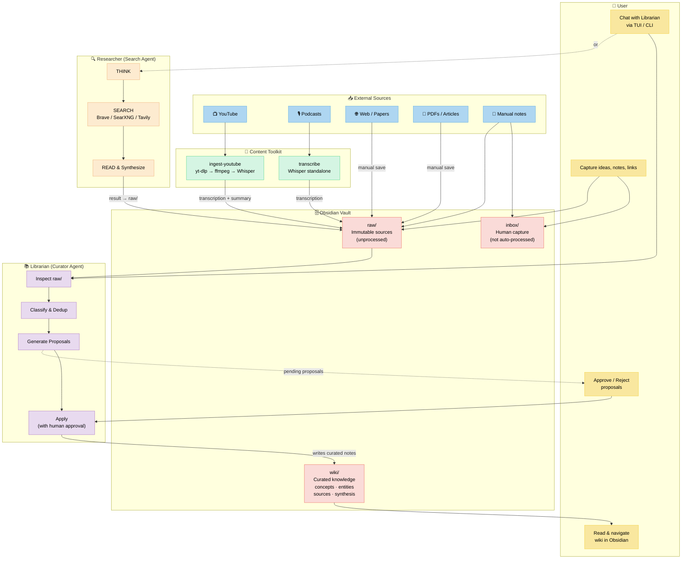

# Second Brain Ecosystem — Architecture

## The Story

I needed to solve a concrete problem: **managing all the information on my PC**.

I started building a virtual library for everything that caught my attention — technical knowledge, books, podcasts, YouTube video summaries. I wanted my own curated, organized knowledge library.

It all started with the [LLM Wiki gist by Karpathy](https://gist.github.com/karpathy/442a6bf555914893e9891c11519de94f). I decided to build a second brain. At first, it was just two folders with hand-written `.md` files. It worked, but eventually managing them became complicated: broken links, duplicate notes, stale content, orphaned ideas.

So I decided to **automate my Second Brain**.

The ecosystem now has these components:

- **Obsidian** — The vault. Where all knowledge lives. The human interface.
- **Librarian** — An agent that maintains the library. It reads raw sources, classifies, detects duplicates, generates proposals, and writes curated notes to the wiki. All with human approval (for now — it's in alpha).
- **Content Toolkit** — Ingestion tools. Video/audio transcription with Whisper, full YouTube → audio → transcription → smart summary pipeline. For when I want complete video summaries.
- **Researcher** — A web search agent (Search-o1 pattern: think → search → read → synthesize). It finds information missing from the library and fills in the blanks. It doesn't depend on Librarian — it's invoked directly.

It's in alpha. It may have bugs. But it's already useful.

---

## Architecture Diagram



---

## Communication Flow

### 1. User ↔ Obsidian

The user interacts directly with Obsidian as the main interface. Writes notes, captures ideas, navigates the wiki. Everything is plain Markdown.

```
User → Obsidian (vault/)
User ← Obsidian (read wiki, search, navigate)
```

### 2. User ↔ Librarian

The user communicates with Librarian through a TUI (terminal) or CLI. Can ask it to process notes, search the wiki, or do maintenance. Librarian generates proposals that require human approval before writing to the wiki.

```
User → Librarian TUI/CLI → "process these notes", "search X"
Librarian → User → "3 pending proposals"
User → Librarian → "approve proposal #42"
Librarian → wiki/ → writes curated note
```

### 3. Content Toolkit → Vault (raw/)

Content Toolkit is a pre-processor. It transforms media (video, audio) into text before reaching the vault. It doesn't depend on Librarian.

```
YouTube URL → ingest-youtube → transcription + summary → raw/
Video/Audio → transcribe → transcription → raw/
```

### 4. Researcher (independent)

Researcher is an autonomous web search agent. It doesn't depend on Librarian — it's invoked directly. It searches the web, reads pages, synthesizes answers. Its output can be copied to `raw/` for Librarian to process later.

```
User → researcher "what is agentic RAG?" → answer + sources
Result → raw/ → (optional) Librarian processes it
```

---

## Ecosystem Components

| Component | Role | Repo |
|-----------|------|------|
| **Obsidian** | Human interface, knowledge vault | Local vault |
| **Librarian** | Wiki curator (proposal-first, human approval) | [`librarian`](https://github.com/Agents4Life/librarian) |
| **Content Toolkit** | Media ingestion (YouTube → text, transcription) | [`content-toolkit`](https://github.com/VanessaPellegrini/content-toolkit) |
| **Researcher** | Agentic web search (Search-o1) | [`researcher`](https://github.com/Agents4Life/researcher) |

---

## Key Decisions

- **Everything enters through `raw/` first** — Don't contaminate `wiki/` with uncurated content.
- **Librarian doesn't search the web** — Its scope is Obsidian management, not Google.
- **Researcher is a separate repo** — Single responsibility, reusable.
- **Content Toolkit is a pre-processor** — Transforms media before reaching the vault.
- **Proposals before apply** — Never write directly to `wiki/` without human approval.
- **Wikilinks > tags** — The connection graph is more valuable than categories.
