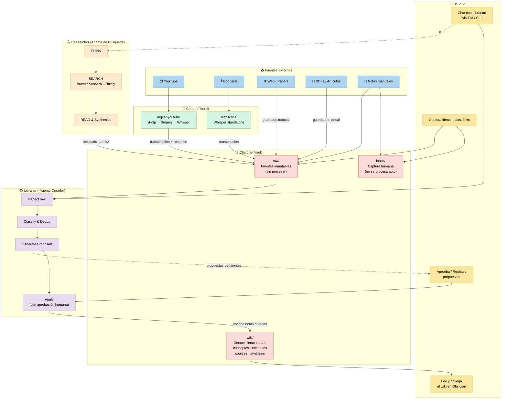

# Arquitectura del Ecosistema — Second Brain

## La Historia

Necesitaba resolver un problema concreto: **el manejo de la información dentro de mi PC**.

Comencé creando una biblioteca virtual para todo lo que me llamaba la atención — conocimiento técnico, libros, podcasts, resúmenes de videos de YouTube. Quería armar mi propia biblioteca de conocimiento, curada y organizada.

Todo empezó con el [gist de Karpathy sobre LLM Wiki](https://gist.github.com/karpathy/442a6bf555914893e9891c11519de94f). Se me ocurrió hacer un segundo cerebro. Al principio fueron dos carpetas con información en archivos `.md` escritos a mano. Funcionaba, pero eventualmente manejarlos se volvía complicado: links rotos, notas duplicadas, contenido desactualizado, ideas huérfanas.

Así que decidí **automatizar mi Second Brain**.

Hoy el ecosistema tiene estos componentes:

- **Obsidian** — El vault. Donde vive todo el conocimiento. Es la interfaz humana.
- **Librarian** — Un agente que mantiene la biblioteca. Lee las fuentes crudas, clasifica, detecta duplicados, genera propuestas y escribe notas curadas al wiki. Todo con aprobación humana (por ahora — está en alpha).
- **Content Toolkit** — Herramientas de ingesta. Transcripción de videos/audio con Whisper, pipeline completo de YouTube → audio → transcripción → resumen inteligente. Para cuando quiero resúmenes completos de videos.
- **Researcher** — Un agente de búsqueda web (patrón Search-o1: piensa → busca → lee → sintetiza). Se encarga de encontrar información que le falta a la biblioteca y complementarla. No depende de Librarian — se invoca directamente.

Está en alpha. Puede tener bugs. Pero ya es útil.

---

## Diagrama de Arquitectura



---

## Flujo de Comunicación

### 1. Usuario ↔ Obsidian

El usuario interactúa directamente con Obsidian como interfaz principal. Escribe notas, captura ideas, navega el wiki. Todo es Markdown plano.

```
Usuario → Obsidian (vault/)
Usuario ← Obsidian (leer wiki, buscar, navegar)
```

### 2. Usuario ↔ Librarian

El usuario se comunica con Librarian a través de una TUI (terminal) o CLI. Le puede pedir que procese notas, busque en el wiki, o haga mantenimiento. Librarian genera propuestas que requieren aprobación humana antes de escribir al wiki.

```
Usuario → Librarian TUI/CLI → "procesá estas notas", "buscá X"
Librarian → Usuario → "tengo 3 propuestas pendientes"
Usuario → Librarian → "aprobá propuesta #42"
Librarian → wiki/ → escribe nota curada
```

### 3. Content Toolkit → Vault (raw/)

Content Toolkit es un pre-procesador. Transforma medios (video, audio) en texto antes de que lleguen al vault. No depende de Librarian.

```
YouTube URL → ingest-youtube → transcripción + resumen → raw/
Video/Audio → transcribe → transcripción → raw/
```

### 4. Researcher (independiente)

Researcher es un agente autónomo de búsqueda web. No depende de Librarian — se invoca directamente. Busca en la web, lee páginas, sintetiza respuestas. Su output puede copiarse a `raw/` para que Librarian lo procese después.

```
Usuario → researcher "qué es agentic RAG?" → respuesta + sources
Resultado → raw/ → (opcional) Librarian lo procesa
```

---

## Componentes del Ecosistema

| Componente | Rol | Repo |
|------------|-----|------|
| **Obsidian** | Interfaz humana, vault de conocimiento | Vault local |
| **Librarian** | Curador del wiki (proposal-first, aprobación humana) | [`librarian`](../librarian/) |
| **Content Toolkit** | Ingesta de medios (YouTube → texto, transcripción) | [`content-toolkit`](../content-toolkit/) |
| **Researcher** | Búsqueda web agéntica (Search-o1) | [`researcher`](../researcher/) |

---

## Decisiones Clave

- **Todo entra por `raw/` primero** — No se contamina `wiki/` con contenido sin curar.
- **Librarian no busca en la web** — Su scope es gestor de Obsidian, no Google.
- **Researcher es repo separado** — Responsabilidad única, reutilizable.
- **Content Toolkit es pre-procesador** — Transforma medios antes de llegar al vault.
- **Propuestas antes de apply** — Nunca se escribe directo a `wiki/` sin aprobación humana.
- **Wikilinks > tags** — El grafo de conexiones es más valioso que categorías.
