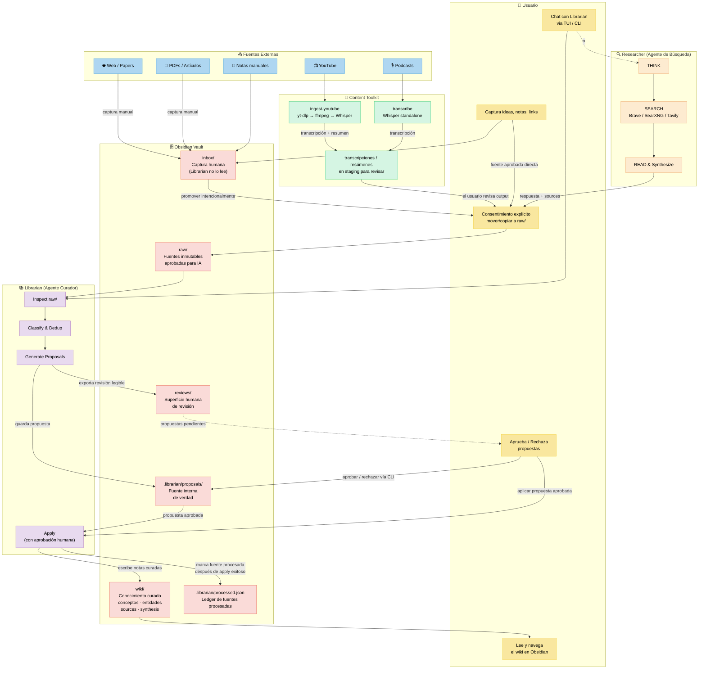

# Arquitectura del Ecosistema — Second Brain

## La Historia

Necesitaba resolver un problema concreto: **el manejo de la información dentro de mi PC**.

Comencé creando una biblioteca virtual para todo lo que me llamaba la atención — conocimiento técnico, libros, podcasts, resúmenes de videos de YouTube. Quería armar mi propia biblioteca de conocimiento, curada y organizada.

Todo empezó con el [gist de Karpathy sobre LLM Wiki](https://gist.github.com/karpathy/442a6bf555914893e9891c11519de94f). Se me ocurrió hacer un segundo cerebro. Al principio fueron dos carpetas con información en archivos `.md` escritos a mano. Funcionaba, pero eventualmente manejarlos se volvía complicado: links rotos, notas duplicadas, contenido desactualizado, ideas huérfanas.

Así que decidí **automatizar mi Second Brain**.

Hoy el ecosistema tiene estos componentes:

- **Obsidian** — El vault. Donde vive todo el conocimiento. Es la interfaz humana.
- **Librarian** — Un pipeline review-driven de mantenimiento de conocimiento para el vault de Obsidian. Lee fuentes ubicadas explícitamente en `raw/`, clasifica, detecta duplicados, genera propuestas y aplica cambios aprobados al wiki. Todas las mutaciones requieren aprobación humana.
- **Content Toolkit** — Herramientas de ingesta. Transcripción de videos/audio con Whisper, pipeline completo de YouTube → audio → transcripción → resumen inteligente. Produce artefactos que puedo guardar explícitamente en `raw/` cuando quiero que Librarian los procese.
- **Researcher** — Un agente de búsqueda web (patrón Search-o1: piensa → busca → lee → sintetiza). Se encarga de encontrar información que le falta a la biblioteca y complementarla. No depende de Librarian — se invoca directamente, y su output puede guardarse en `raw/` cuando sea útil.

Está en alpha. Puede tener bugs. Pero ya es útil.

---

## Diagrama de Arquitectura



---

## Flujo de Comunicación

### 1. Usuario ↔ Obsidian

El usuario interactúa directamente con Obsidian como interfaz principal. Escribe notas, captura ideas, revisa páginas generadas del wiki y navega el grafo de conocimiento. Todo es Markdown plano.

```
Usuario → Obsidian (vault/)
Usuario ← Obsidian (leer wiki/, buscar, navegar)
```

### 2. Usuario ↔ Librarian

El usuario se comunica con Librarian a través de una TUI (terminal) o CLI. Le puede pedir que ingiera fuentes aprobadas, busque en el wiki, o haga mantenimiento. Librarian genera propuestas antes de cualquier mutación.

`reviews/` es una superficie humana de revisión y export. `.librarian/proposals/` es la fuente de verdad interna de propuestas.

```
Usuario → Librarian TUI/CLI → "ingerí fuentes aprobadas", "buscá X en wiki"
Librarian → .librarian/proposals/ → guarda propuesta
Librarian → reviews/ → exporta propuesta legible
Usuario → Librarian → "aprobá propuesta #42"
Usuario → Librarian → "aplicá propuesta #42"
Librarian → wiki/ → escribe nota curada
Librarian → .librarian/processed.json → marca fuente procesada
```

### 3. Content Toolkit → Usuario → Vault (raw/)

Content Toolkit es un pre-procesador. Transforma medios (video, audio) en texto, pero no decide qué puede procesar Librarian. El usuario revisa el output y lo guarda o mueve explícitamente a `raw/` cuando debe entrar a la capa procesable por IA.

```
YouTube URL → ingest-youtube → transcripción + resumen → revisión humana → raw/
Video/Audio → transcribe → transcripción → revisión humana → raw/
```

### 4. Researcher (independiente)

Researcher es un agente de búsqueda web. No depende de Librarian — se invoca directamente. Busca en la web, lee páginas y sintetiza respuestas. Su output puede copiarse a `raw/` por el usuario para que Librarian lo procese después.

```
Usuario → researcher "qué es agentic RAG?" → respuesta + sources
Usuario revisa resultado → raw/ → (opcional) Librarian lo procesa
```

---

## Componentes del Ecosistema

| Componente | Rol | Repo |
|------------|-----|------|
| **Obsidian** | Interfaz humana, vault de conocimiento | Vault local |
| **Librarian** | Pipeline review-driven y proposal-based de mantenimiento de conocimiento | [`librarian`](../librarian/) |
| **Content Toolkit** | Ingesta de medios (YouTube → texto, transcripción) con entrada al vault aprobada por el usuario | [`content-toolkit`](../content-toolkit/) |
| **Researcher** | Búsqueda web agéntica (Search-o1) | [`researcher`](../researcher/) |

---

## Decisiones Clave

- **Todo lo que Librarian procesa entra por `raw/` primero** — `raw/` es la frontera explícita de consentimiento para procesamiento con IA.
- **Librarian no busca en la web** — Su scope es gestor de Obsidian, no Google.
- **Researcher es repo separado** — Responsabilidad única, reutilizable.
- **Content Toolkit es pre-procesador** — Transforma medios antes de que el usuario decida si el resultado pertenece en `raw/`.
- **Propuestas antes de apply** — Nunca se escribe directo a `wiki/` sin aprobación humana y un paso explícito de apply.
- **Reviews y proposals son superficies separadas** — `reviews/` es para revisión humana; `.librarian/proposals/` es la fuente interna de verdad.
- **Wikilinks > tags** — El grafo de conexiones es más valioso que categorías.
