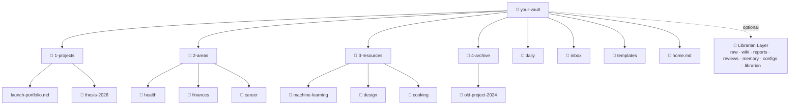

# Vault Structure

A vault without structure becomes a junk drawer. A vault with too much structure becomes a prison.

The goal: **just enough structure to find things, not so much that it slows you down.**

## The PARA Method

The most popular organizing system for a Second Brain is **PARA**, created by Tiago Forte:

| Folder | What goes here | Example |
|--------|---------------|---------|
| **P**rojects | Active things with a deadline or goal | `launch-portfolio`, `thesis-2026` |
| **A**reas | Ongoing responsibilities with no end date | `health`, `finances`, `career` |
| **R**esources | Topics you're interested in | `machine-learning`, `design`, `cooking` |
| **A**rchive | Completed projects and inactive items | `old-project-2024` |

### How it looks in your vault:



> 💡 The numbers (1-, 2-, 3-, 4-) keep folders in priority order in the file explorer.

## Base Structure (without AI)

If you are not using Librarian, your vault looks like this:

```text
vault/
  1-projects/
  2-areas/
  3-resources/
  4-archive/
  daily/
  inbox/
  templates/
  _assets/
  home.md
```

This is all you need for a fully functional Second Brain with PARA. No AI dependency or additional tools required.

## Optional AI Operational Layer: Librarian

**PARA organizes your life and projects. Librarian organizes the AI-processable knowledge layer.**

This layer is optional. Your Second Brain works without it. If you plan to use Librarian, the full vault structure looks like this:

```text
vault/
  1-projects/     # PARA: active work with goals or deadlines
  2-areas/        # PARA: ongoing responsibilities
  3-resources/    # PARA: useful topics and references
  4-archive/      # PARA: inactive or completed material
  daily/          # daily human notes, not processed by Librarian by default
  inbox/          # quick human capture, not read by Librarian
  raw/            # immutable sources explicitly approved for AI processing
  wiki/           # structured knowledge generated/curated by Librarian
  reports/        # vault diagnostics generated when requested
  reviews/        # proposals pending approval/rejection/editing
  memory/         # persistent agent/session memory
  configs/        # visible/editable Librarian configuration
  templates/
  .librarian/     # internal state, indexes, cache, locks
  _assets/        # attachments and images
  home.md
```

The relationship between folders:

| Folder | Role | Who writes |
|--------|------|------------|
| `inbox/` | Temporary human capture. Librarian never reads it directly. | You |
| `daily/` | Daily human notes. Not processed by Librarian by default. | You |
| `1-projects/`, `2-areas/`, `3-resources/`, `4-archive/` | PARA organization for your human Second Brain | You |
| `raw/` | Immutable sources approved for Librarian to read | You (explicit consent) |
| `wiki/` | Structured knowledge | Librarian |
| `reviews/` | Human-readable review and export surface | Librarian (you approve via CLI) |
| `reports/` | Vault diagnostics | Librarian |
| `memory/` | Agent continuity across sessions | Librarian |
| `configs/` | Explicit configuration rules | You |
| `.librarian/` | Internal technical state | Librarian |
| `_assets/` | Attachments, images, and binary files | You / Obsidian |

The user captures and organizes life in `inbox/`, `daily/`, and PARA. Only when the user decides a source can be read by AI do they move or copy it into `raw/`. Librarian never processes `inbox/`, `daily/`, or PARA directly.

Inside `wiki/`, Librarian expects this structure:

```text
wiki/
  index.md
  log.md
  conceptos/
  entidades/
  sources/
  synthesis/
```

`reviews/` is a human-readable review and export surface. `.librarian/proposals/` is the internal proposal source of truth. Before modifying the wiki, Librarian generates proposals that you review, approve, and apply via the CLI. The wiki is only modified through approve/apply. This keeps you in full control of your knowledge.

## The Home Note

Create a note called `home.md` and pin it as your opening note. This is your **dashboard** — the first thing you see when you open Obsidian.

```markdown
# 🏠 Home

## Active Projects
- [[launch-portfolio]] — Launch by June
- [[thesis-2026]] — First draft due April

## Quick Links
- [[reading-list]]
- [[weekly-review-template]]
- [[habits-tracker]]

## Today
![[{{date:YYYY-MM-DD}}]]
```

> To pin a note: right-click the tab → **"Pin"**. It stays open when you switch notes.

## Naming Conventions

Good naming makes everything searchable:

| Rule | Example |
|------|---------|
| Use lowercase with hyphens | `machine-learning.md`, not `Machine Learning.md` |
| Be descriptive | `interview-prep-questions.md`, not `notes2.md` |
| Date prefix for time-based notes | `2026-05-12-meeting-with-jane.md` |
| Use folders for grouping | `career/`, not 50 loose files |

## When in Doubt: Inbox

Not sure where a note goes? Create an `inbox/` folder at the vault root. Dump things there and sort later during a weekly review.

```
📁 your-vault/
├── 📁 inbox/             ← Unsorted notes (sort weekly)
├── 📁 daily/
├── 📁 1-projects/
├── 📁 2-areas/
├── 📁 3-resources/
├── 📁 4-archive/
├── 📁 raw/               ← Only sources approved for AI processing
├── 📁 templates/
└── 📄 home.md
```

> The inbox is not a trash can. Clean it out weekly. If a note sits there for a month, archive it or delete it.

## The MOC (Map of Content)

As your vault grows, you'll want **MOCs** — index notes that link to related notes on a topic.

```markdown
# 🗺️ Machine Learning MOC

## Fundamentals
- [[what-is-machine-learning]]
- [[supervised-vs-unsupervised]]
- [[common-algorithms]]

## Courses
- [[andrew-ng-course-notes]]
- [[fast-ai-lectures]]

## Practice
- [[kaggle-projects]]
- [[ml-interview-prep]]
```

MOCs are like tables of contents for your brain. Start creating them when a topic has 5+ notes.

## Don't Overthink It

The perfect structure doesn't exist. Start with PARA, adjust as you go. Your vault will tell you what it needs after a few weeks of use.

**Principles over rules.**

## What's Next?

→ **[05 — Essential Plugins](./05-essential-plugins.md)**

---

[← 03 — Setting Up Obsidian](./03-setting-up-obsidian.md) · [Español](../es/04-vault-structure.md)
