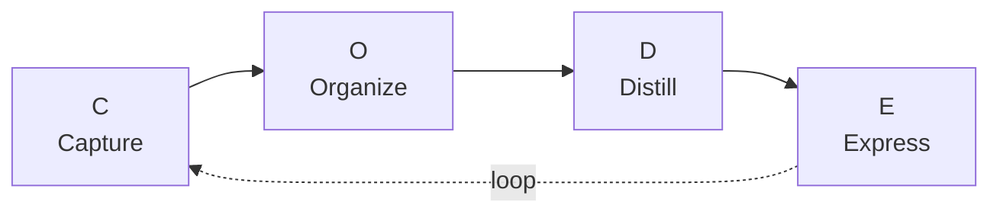
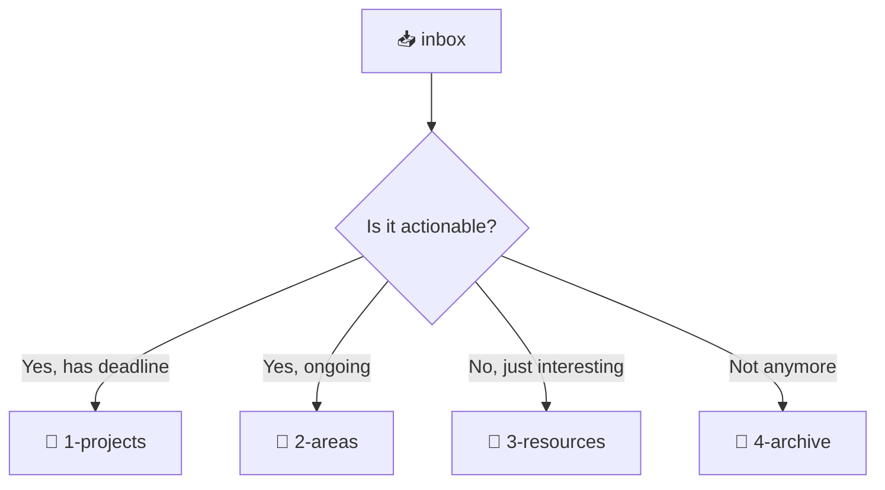
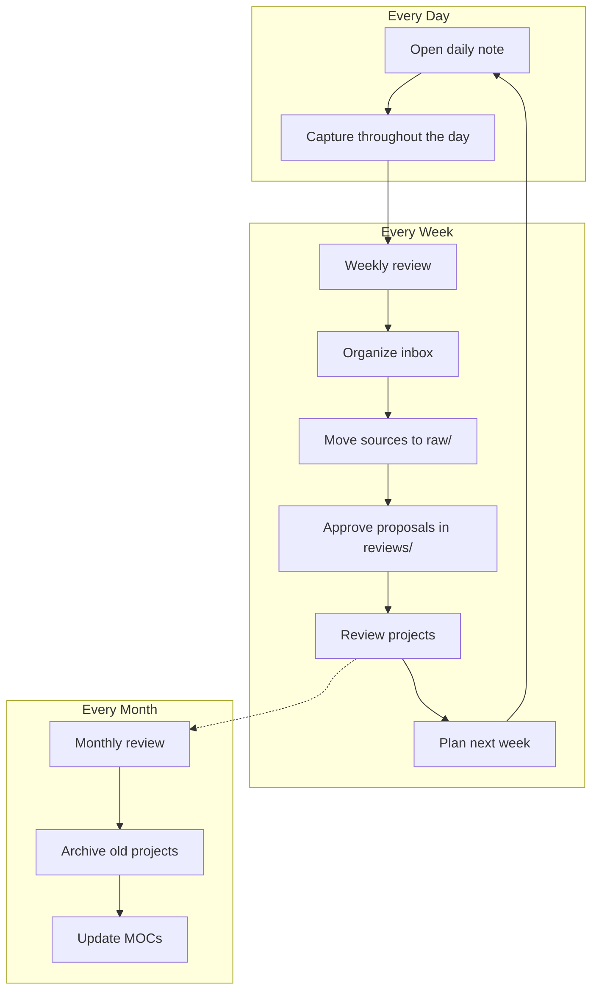

# Your Workflow

A Second Brain without a workflow is just a pile of notes. A workflow without a Second Brain is just a habit tracker.

Together, they become a **thinking engine**.

## The CODE Framework

We mentioned CODE briefly in guide 01. Here's how it works in practice:



### 1. 📥 Capture — Save What Resonates

Don't try to capture everything. Capture what **resonates** — ideas that make you think "hmm, that's interesting" or "I'll need this later."

**Where to capture from:**

| Source | How |
|--------|-----|
| Articles & blogs | Web Clipper → `inbox/` |
| Books | Highlight → type key quotes into a note |
| Meetings | Daily note → write 3 bullet points |
| Podcasts | Pause → write the key idea in mobile app |
| Random ideas | Quick note on phone → `inbox/idea-*.md` |
| Code snippets | Directly in a project note |
| Conversations | Write down the insight after the chat |

If you use Librarian, `inbox/` is still for quick capture. During weekly review, move only the sources you want AI to read into `raw/`. Also check proposals in `reviews/` and diagnostics in `reports/`. Examples: articles, book highlights, podcast notes, papers, or transcripts.

**The 2-second rule:** If it takes more than 2 seconds to capture something, your system is too complicated. Fix it.

### 2. 🗂️ Organize — Put It Where You'll Find It

Move notes from `inbox/` to their home using PARA:



> 💡 PARA, `daily/`, and `inbox/` are the human layer. Copy or move only sources you want Librarian to process into `raw/`.

**When to organize:** During your weekly review (we'll set that up below).

### 3. 🔍 Distill — Extract the Essence

Raw notes are hard to use. **Progressive summarization** helps you find the gold:

1. **Bold** the key points in a note
2. **Highlight** the most important bold parts
3. Write a **one-paragraph summary** at the top

You don't do this for every note — only the ones that matter.

### 4. 🚀 Express — Create and Share

Your Second Brain pays off when you **use** it to create:

- Write a blog post → pull from your resource notes
- Prepare a presentation → link relevant project notes
- Make a decision → review your area notes
- Learn a new skill → connect related concepts

> The ultimate purpose of a Second Brain is not to store information — it's to **produce** with it.

## The Weekly Review

This is the **most important habit**. Without it, your Second Brain degrades into a junk drawer.

Set aside 30 minutes every week (Sunday evening or Monday morning):

```markdown
## Weekly Review Template

### 1. Clean Inbox (8 min)
- [ ] Move all inbox notes to their PARA home
- [ ] Move valuable AI sources to raw/
- [ ] Delete notes that aren't useful anymore

### 2. Review Librarian Proposals (5 min)
- [ ] Approve, edit, or reject proposals in reviews/
- [ ] Check diagnostics in reports/

### 3. Review Projects (10 min)
- [ ] Update active project notes
- [ ] Move completed projects to archive
- [ ] Create new project notes if needed

### 4. Plan Next Week (7 min)
- [ ] Review calendar and commitments
- [ ] Set 3 priorities for the week
- [ ] Create next week's daily notes ahead of time
```

## The Daily Note Habit

Your daily note is the **entry point** to your Second Brain. Open it first thing every day.

```markdown
# {{date:YYYY-MM-DD}} — {{date:dddd}}

## 🎯 Today's Focus
- [ ] 

## 📝 Notes
- 

## 💡 Ideas
- 

## 📥 Captured
- 

---
## Links
- [[weekly-review-{{date:gggg-ww}}]]
```

Build the habit: **open Obsidian → create daily note → start capturing.**

## The Flow in Practice



## The Honest Truth

You won't be perfect. You'll skip weekly reviews. Your inbox will overflow sometimes. That's fine.

The best Second Brain is the one you **actually use** — not the one that looks perfect on paper.

Start with daily notes. Add weekly reviews when you're ready. Everything else builds from there.

## What's Next?

→ **[07 — Next Level with AI](./07-next-level-with-ai.md)**

---

[← 05 — Essential Plugins](./05-essential-plugins.md) · [Español](../es/06-workflow.md)
