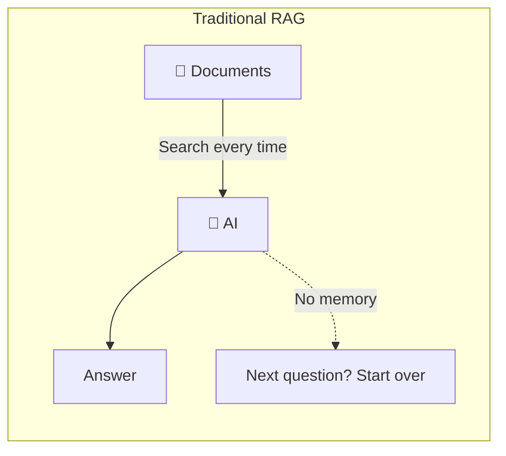
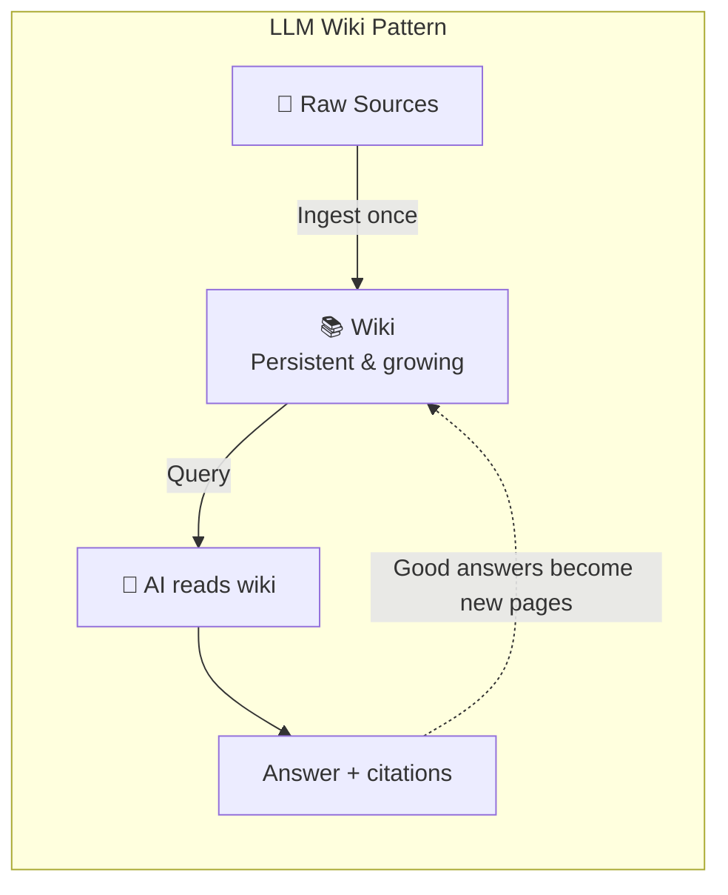
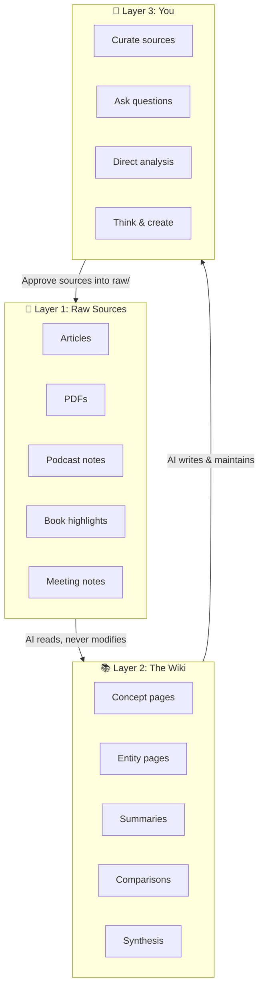
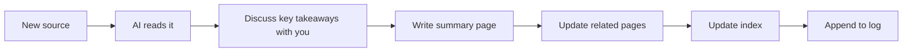
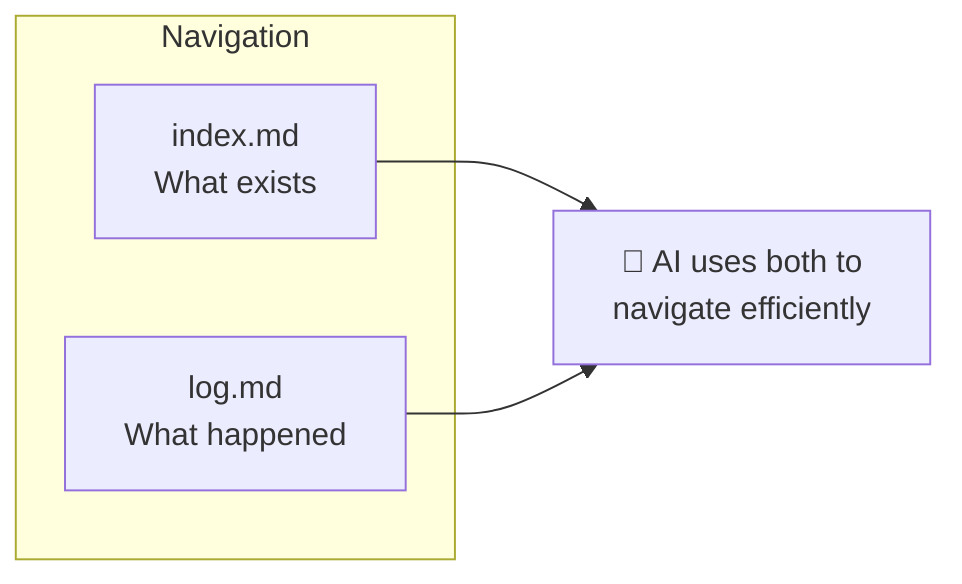
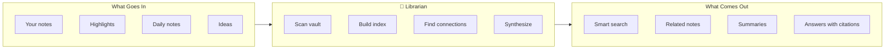
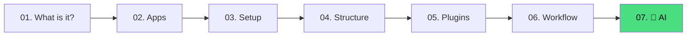

# Next Level with AI

Your Second Brain is working. You're capturing, organizing, and creating. If you want AI assistance, this optional layer can make it *smarter*.

> This guide is optional. The core Second Brain setup from guides 01-06 works without Librarian, local LLMs, or any agent layer.

## The Problem

As your vault grows, you'll hit walls:

- **100 notes** — You can still find things manually
- **500 notes** — Search works, but you miss connections
- **1,000+ notes** — There's gold buried in there you'll never see

This is where AI can help. Not to replace your thinking — to **augment** it.

## RAG vs. LLM Wiki

You may have seen AI tools that let you "chat with your documents" — upload a PDF, ask questions, get answers. That's called **RAG** (Retrieval-Augmented Generation). It works, but it has a fundamental limitation:

> Every time you ask a question, the AI starts from scratch. Nothing is remembered. Nothing compounds.



For people who want an agent-assisted vault, there's a better way. It's called the **LLM Wiki pattern**, and it's the idea behind Librarian.

Instead of searching raw documents on every question, the AI **incrementally builds and maintains a persistent wiki** — a structured, interlinked collection of markdown files that sits between you and your raw sources.



The difference: **the wiki compounds.** The cross-references are already built. The contradictions are already flagged. The synthesis already reflects everything you've read. It gets richer with every source you add and every question you ask.

This concept was articulated by [Andrej Karpathy](https://gist.github.com/karpathy/442a6bf555914893e9891c11519de94f) and it's the foundation of what Librarian does.

| Traditional RAG | LLM Wiki (Librarian) |
|----------------|----------------------|
| Searches raw docs every time | Builds a persistent, growing wiki |
| Rediscovers knowledge from scratch | Knowledge accumulates and connects |
| No memory between questions | Contradictions flagged, connections maintained |
| You do the connecting work | AI does the bookkeeping |
| Answers disappear in chat history | Good answers become new wiki pages |

## How It Works: The Three Layers

The optional LLM Wiki pattern has three distinct layers inside your vault:

> **PARA organizes your life and projects. Librarian optionally organizes the AI-processable knowledge layer.** They don't compete — they cooperate. Your PARA structure stays intact; Librarian adds its own operational layer alongside it only if you choose to use it.



### Layer 1: Raw Sources (Your Input)

Articles, PDFs, book highlights, podcast notes, meeting transcripts — anything you want to learn from. These are **immutable** — the AI reads them but never changes them. This is your source of truth.

In the vault, this layer lives in `raw/`. `raw/` is the explicit consent boundary for AI processing: only sources you move or copy there are read by Librarian. Your PARA folders, `daily/`, and `inbox/` stay outside `raw/` as the human layer.

### Layer 2: The Wiki (The AI's Work)

A directory of markdown files that the AI creates and maintains. Concept pages, entity pages, summaries, comparisons, cross-references. The AI owns this layer entirely. It creates pages, updates them when new sources arrive, and keeps everything consistent.

Librarian expects this minimal structure:

```text
wiki/
  index.md
  log.md
  conceptos/
  entidades/
  sources/
  synthesis/
```

**You read it. The AI writes it.**

Think of it like a fan wiki (e.g., [Tolkien Gateway](https://tolkiengateway.net/wiki/Main_Page)) — thousands of interlinked pages built over years by volunteers. Except the AI does all the cross-referencing and maintenance in seconds.

### Layer 3: You (The Director)

Your job is to:
- **Curate** — Decide what sources are worth adding
- **Explore** — Ask questions, follow links, chase ideas
- **Direct** — Tell the AI what to emphasize, what to dig into
- **Think** — The AI handles bookkeeping so you can focus on thinking

### Complete Librarian Folder Map

If you enable Librarian, the three conceptual layers materialize as these folders inside your vault:

| Folder | Role | Who writes |
|--------|------|------------|
| `1-projects/` | Projects with deadlines | You |
| `2-areas/` | Ongoing responsibilities | You |
| `3-resources/` | Useful references | You |
| `4-archive/` | Inactive items | You |
| `daily/` | Daily human notes, not processed by Librarian by default | You |
| `inbox/` | Temporary human capture. Librarian never reads it directly. | You |
| `raw/` | Immutable sources explicitly approved for AI processing | You |
| `wiki/` | Structured knowledge | Librarian |
| `reviews/` | Human-readable review and export surface | Librarian (you approve via CLI) |
| `reports/` | Vault diagnostics | Librarian |
| `memory/` | Agent continuity across sessions | Librarian |
| `configs/` | Explicit configuration rules | You |
| `.librarian/` | Internal state: indexes, proposals, cache, locks | Librarian |

## The Three Operations

The AI performs three core operations on your wiki:

### 1. 📥 Ingest

You drop a new source into your raw collection. The AI:



A single source might touch 10–15 wiki pages. The AI reads the article, extracts key ideas, creates new pages, and updates existing ones — all the cross-referencing that humans find tedious.

### 2. ❓ Query

You ask questions. The AI searches the wiki, reads relevant pages, and synthesizes an answer with citations. The key insight:

> **Good answers become new wiki pages.** A comparison you asked for, an analysis, a connection you discovered — these are valuable and shouldn't disappear into chat history.

This way your explorations compound in the knowledge base, just like ingested sources do.

### 3. 🧹 Lint

Periodically, the AI health-checks the wiki:

- Contradictions between pages
- Stale claims superseded by newer sources
- Orphan pages with no inbound links
- Important concepts mentioned but lacking their own page
- Missing cross-references

This keeps the wiki healthy as it grows. Humans abandon wikis because the maintenance burden grows faster than the value. AI doesn't get bored.

## The Index and the Log

Two special files help navigate the wiki:

### 📇 index.md

A catalog of everything in the wiki — each page listed with a link, a one-line summary, and metadata. Organized by category (concepts, entities, sources). The AI updates it on every ingest.

Expected path: `wiki/index.md`.

### 📋 log.md

An append-only chronological record of what happened and when — ingests, queries, lint passes. Gives you a timeline of your wiki's evolution.

Expected path: `wiki/log.md`.



At moderate scale (~100 sources, hundreds of pages), this simple index-based approach works surprisingly well — no complex vector database needed.

## Why This Works

The tedious part of maintaining a knowledge base is not the reading or the thinking — it's the **bookkeeping**. Updating cross-references, keeping summaries current, noting when new data contradicts old claims, maintaining consistency across dozens of pages.

> Humans abandon wikis because the maintenance burden grows faster than the value. AI doesn't get bored, doesn't forget to update a cross-reference, and can touch 15 files in one pass.

The human's job is to curate sources, direct the analysis, ask good questions, and think about what it all means. The AI's job is everything else.

This idea echoes Vannevar Bush's **Memex** (1945) — a personal, curated knowledge store with associative trails between documents. Bush's vision was closer to this than to what the web became. The part he couldn't solve was: *who does the maintenance?* The AI handles that.

## Meet Librarian 🤖

**Librarian** is the AI agent that implements this pattern for your Obsidian vault.



### Privacy First

- When using local providers like Ollama, notes remain local. Cloud providers may receive relevant note fragments depending on configuration.
- Embeddings are generated **locally** when possible
- No data is sent to third parties without your explicit consent
- You own your knowledge — always

For a local-first setup, follow the [Local LLM Setup](../../../local-LLM/README.md) guide before connecting Librarian to your vault.

### Getting Started with Librarian

1. Make sure your vault is organized (guides 01–06)
2. Configure a local model with **[Local LLM Setup](../../../local-LLM/README.md)**
3. Head to the **[Librarian repository](https://github.com/Agents4Life/librarian)**
4. Follow the installation guide
5. Let it scan your vault
6. Start asking questions

> ⚠️ Librarian is currently in development as a separate repository. Check [github.com/Agents4Life/librarian](https://github.com/Agents4Life/librarian) for the latest status.

## Tips for an AI-Powered Vault

These practices make your wiki work better with AI:

| Tip | Why it helps |
|-----|-------------|
| **Use consistent folder names** | AI navigates your structure more reliably |
| **Move or copy sources you want curated into `raw/` before asking for curation** | `raw/` marks explicit consent for Librarian to process it |
| **Let the AI lint weekly** | Keeps the wiki healthy without your effort |
| **Save good Q&A as wiki pages** | Your explorations compound over time |
| **Use Obsidian's graph view** | See the shape of your wiki — hubs, orphans, clusters |
| **Download images locally** | AI can reference them directly (Ctrl+Shift+D in Obsidian) |
| **Use the Web Clipper** | Get articles into your raw collection in one click |

## The Complete Journey

You made it. Here's everything we covered:



From "what is a Second Brain?" to "my Second Brain has a persistent, compounding, AI-powered wiki." Not bad.

## Deep Dive

Want to understand the LLM Wiki pattern in its original form? Read [Karpathy's LLM Wiki gist](https://gist.github.com/karpathy/442a6bf555914893e9891c11519de94f) — the foundational document that inspired Librarian.

## Keep Going

- ⭐ Star this repo if it helped you
- 🐛 Found an issue? [Open one](../../../issues)
- 💬 Have questions? Start a [discussion](../../../discussions)
- 🌍 Want to help translate? PRs welcome!

---

**Happy thinking.** 🧠

[← 06 — Your Workflow](./06-workflow.md) · [Español](../es/07-next-level-with-ai.md) · [Back to top ↑](../../../README.md)
