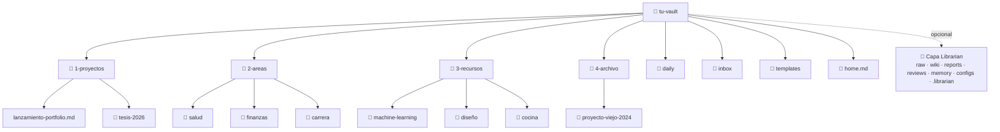
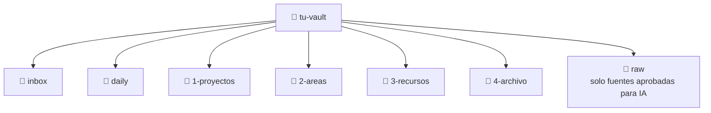

# Estructura del Vault

Un vault sin estructura se convierte en un cajón desastre. Un vault con demasiada estructura se convierte en una prisión.

El objetivo: **suficiente estructura para encontrar las cosas, no tanta que te frene.**

## El Método PARA

El sistema de organización más popular para un Segundo Cerebro es **PARA**, creado por Tiago Forte:

| Carpeta | Qué va acá | Ejemplo |
|---------|-----------|---------|
| **P**royectos | Cosas activas con deadline o meta | `lanzamiento-portfolio`, `tesis-2026` |
| **Á**reas | Responsabilidades ongoing sin fecha de fin | `salud`, `finanzas`, `carrera` |
| **R**ecursos | Temas que te interesan | `machine-learning`, `diseño`, `cocina` |
| **A**rchivo | Proyectos completados e items inactivos | `proyecto-viejo-2024` |

### Cómo se ve en tu vault:



> 💡 Los números (1-, 2-, 3-, 4-) mantienen las carpetas en orden de prioridad en el explorador de archivos.

## Estructura Base (sin IA)

Si no vas a usar Librarian, tu vault se ve así:

```text
vault/
  1-proyectos/
  2-areas/
  3-recursos/
  4-archivo/
  daily/
  inbox/
  templates/
  _assets/
  home.md
```

Esto es todo lo que necesitás para un Second Brain funcional con PARA. No hay dependencia de IA ni herramientas adicionales.

## Capa Operativa de IA Opcional: Librarian

**PARA organiza tu vida y tus proyectos. Librarian organiza la capa de conocimiento procesable por IA.**

Esta capa es opcional. Tu Segundo Cerebro funciona sin ella. Si vas a usar Librarian, la estructura completa del vault se ve así:

```text
vault/
  1-proyectos/    # PARA: trabajo activo con metas o deadlines
  2-areas/        # PARA: responsabilidades continuas
  3-recursos/     # PARA: temas y referencias útiles
  4-archivo/      # PARA: material inactivo o completado
  daily/          # notas diarias humanas, no procesadas por Librarian por defecto
  inbox/          # captura humana rápida, Librarian no la lee
  raw/            # fuentes inmutables aprobadas explícitamente para IA
  wiki/           # conocimiento estructurado generado/curado por Librarian
  reports/        # diagnósticos del vault generados bajo demanda
  reviews/        # propuestas pendientes de aprobar/rechazar/editar
  memory/         # memoria persistente del agente/sesiones
  configs/        # configuración visible/editable de Librarian
  templates/
  .librarian/     # estado interno, índices, cache, locks
  _assets/        # adjuntos e imágenes
  home.md
```

La relación entre carpetas:

| Carpeta | Rol | Quién escribe |
|---------|-----|---------------|
| `inbox/` | Captura humana temporal. Librarian nunca la lee directamente. | Vos |
| `daily/` | Notas diarias humanas. No las procesa Librarian por defecto. | Vos |
| `1-proyectos/`, `2-areas/`, `3-recursos/`, `4-archivo/` | Organización PARA para tu Segundo Cerebro humano | Vos |
| `raw/` | Fuentes inmutables aprobadas para que Librarian las lea | Vos (consentimiento explícito) |
| `wiki/` | Conocimiento ya estructurado | Librarian |
| `reviews/` | Superficie humana de revisión y export | Librarian (vos aprobás vía CLI) |
| `reports/` | Diagnósticos del vault | Librarian |
| `memory/` | Continuidad del agente entre sesiones | Librarian |
| `configs/` | Reglas explícitas de configuración | Vos |
| `.librarian/` | Estado técnico interno | Librarian |
| `_assets/` | Adjuntos, imágenes y archivos binarios | Vos / Obsidian |

El usuario captura y organiza su vida en `inbox/`, `daily/` y PARA. Solo cuando decide que una fuente puede ser leída por IA, la mueve o copia a `raw/`. Librarian nunca procesa `inbox/`, `daily/` ni PARA directamente.

Dentro de `wiki/`, Librarian espera esta estructura:

```text
wiki/
  index.md
  log.md
  conceptos/
  entidades/
  sources/
  synthesis/
```

`reviews/` es una superficie humana de revisión y export. `.librarian/proposals/` es la fuente de verdad interna de propuestas. Antes de modificar la wiki, Librarian genera propuestas que revisás, aprobás y aplicás vía CLI. La wiki solo se modifica vía approve/apply. Así mantenés control total sobre tu conocimiento.

## La Nota Home

Creá una nota llamada `home.md` y pineala como nota de apertura. Este es tu **dashboard** — lo primero que ves cuando abrís Obsidian.

```markdown
# 🏠 Home

## Proyectos Activos
- [[lanzamiento-portfolio]] — Lanzar antes de junio
- [[tesis-2026]] — Primer borrador para abril

## Links Rápidos
- [[lista-de-lectura]]
- [[template-revision-semanal]]
- [[tracker-habitos]]

## Hoy
![[{{date:YYYY-MM-DD}}]]
```

> Para pinear una nota: click derecho en la pestaña → **"Pin"**. Se queda abierta cuando cambiás de nota.

## Convenciones de Nombres

Un buen naming hace todo searchable:

| Regla | Ejemplo |
|-------|---------|
| Usá minúsculas con guiones | `machine-learning.md`, no `Machine Learning.md` |
| Sé descriptivo/a | `preguntas-prep-entrevista.md`, no `notas2.md` |
| Prefijo de fecha para notas temporales | `2026-05-12-reunion-con-ana.md` |
| Usá carpetas para agrupar | `carrera/`, no 50 archivos sueltos |

## Cuando no sepas: Inbox

¿No estás segura dónde va una nota? Creá una carpeta `inbox/` en la raíz del vault. Tirá cosas ahí y ordenalas después en la revisión semanal.



> El inbox no es un tacho. Limpiálo semanalmente. Si una nota pasa un mes ahí, archivala o borrala.

## El MOC (Mapa de Contenido)

A medida que tu vault crece, vas a querer **MOCs** — notas índice que linkean a notas relacionadas de un tema.

```markdown
# 🗺️ Machine Learning MOC

## Fundamentos
- [[que-es-machine-learning]]
- [[supervisado-vs-no-supervisado]]
- [[algoritmos-comunes]]

## Cursos
- [[notas-curso-andrew-ng]]
- [[lecturas-fast-ai]]

## Práctica
- [[proyectos-kaggle]]
- [[prep-entrevista-ml]]
```

Los MOCs son como índices para tu cerebro. Empezá a crearlos cuando un tema tenga 5+ notas.

## No lo Pienses Demasiado

La estructura perfecta no existe. Empezá con PARA, ajustá sobre la marcha. Tu vault te va a decir qué necesita después de unas semanas de uso.

**Principios antes que reglas.**

## ¿Qué sigue?

→ **[05 — Plugins esenciales](./05-essential-plugins.md)**

---

[← 03 — Configurar Obsidian](./03-setting-up-obsidian.md) · [English](../en/04-vault-structure.md)
