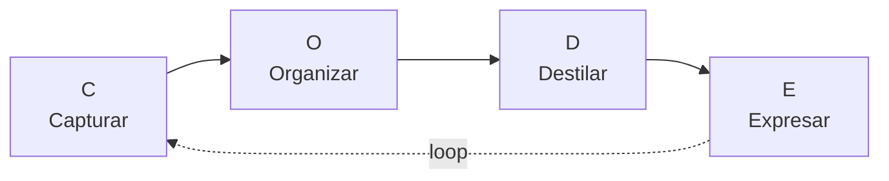
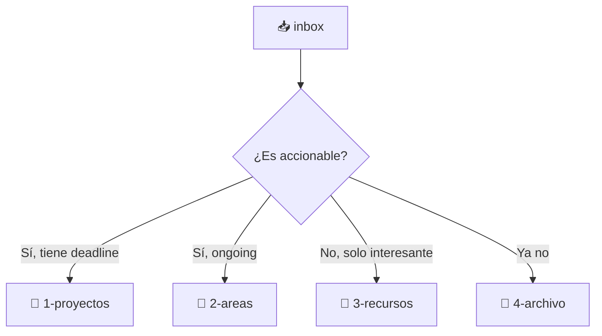
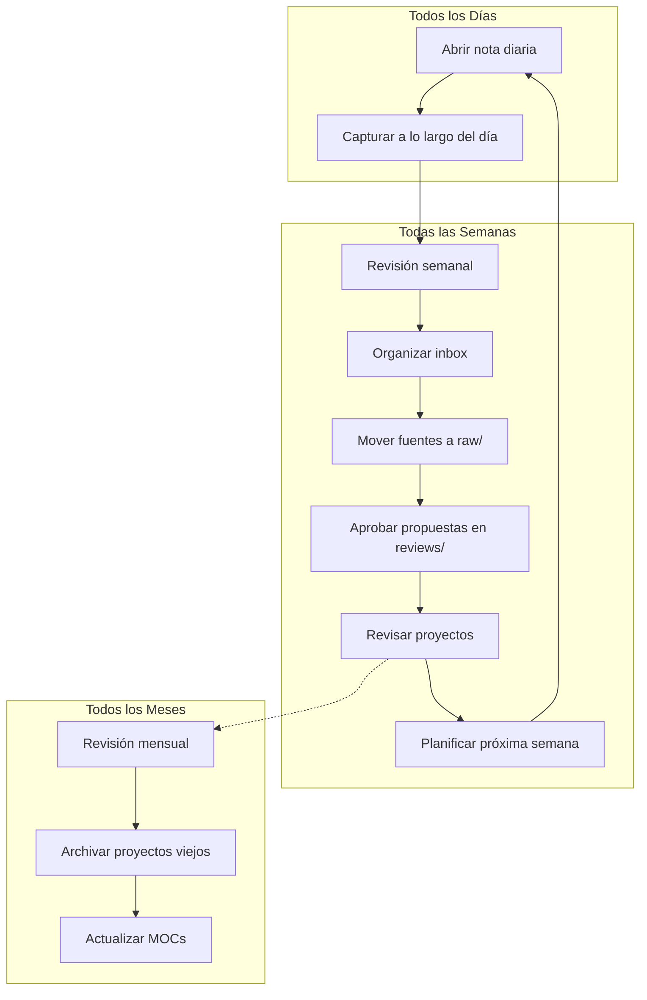

# Tu Flujo de Trabajo

Un Segundo Cerebro sin flujo de trabajo es solo un montón de notas. Un flujo de trabajo sin Segundo Cerebro es solo un tracker de hábitos.

Juntos, se convierten en un **motor de pensamiento**.

## El Framework CODE

Mencionamos CODE brevemente en la guía 01. Acá va cómo funciona en la práctica:



### 1. 📥 Capturar — Guardá lo que te resuena

No intentes capturar todo. Capturá lo que **te resuena** — ideas que te hacen pensar "hmm, qué interesante" o "voy a necesitar esto después".

**Desde dónde capturar:**

| Fuente | Cómo |
|--------|------|
| Artículos y blogs | Web Clipper → `inbox/` |
| Libros | Resaltar → tipear citas clave en una nota |
| Reuniones | Nota diaria → escribir 3 bullets |
| Podcasts | Pausar → escribir la idea clave en la app mobile |
| Ideas random | Nota rápida en el celu → `inbox/idea-*.md` |
| Snippets de código | Directamente en una nota de proyecto |
| Conversaciones | Escribir el insight después del chat |

Si usás Librarian, `inbox/` sigue siendo para captura rápida. Durante la revisión semanal, mové a `raw/` solo las fuentes que querés que la IA lea y convierta en wiki. También revisá las propuestas en `reviews/` y los diagnósticos en `reports/`. Ejemplos de fuentes: artículos, highlights de libros, notas de podcasts, papers o transcripciones.

**La regla de los 2 segundos:** Si te toma más de 2 segundos capturar algo, tu sistema es muy complicado. Arreglalo.

### 2. 🗂️ Organizar — Ponelo donde lo vas a encontrar

Mové notas del `inbox/` a su hogar usando PARA:



> 💡 PARA, `daily/` e `inbox/` son la capa humana. Copiá o mové a `raw/` solo las fuentes que querés que Librarian procese.

**Cuándo organizar:** Durante tu revisión semanal (la configuramos abajo).

### 3. 🔍 Destilar — Extraé la Esencia

Las notas crudas son difíciles de usar. La **sumarización progresiva** te ayuda a encontrar lo valioso:

1. **Negrita** en los puntos clave de una nota
2. **Resaltar** las partes más importantes de lo que ya está en negrita
3. Escribir un **resumen de un párrafo** arriba de todo

No hacés esto con cada nota — solo con las que importan.

### 4. 🚀 Expresar — Creá y Compartí

Tu Segundo Cerebro rinde frutos cuando lo **usás** para crear:

- Escribís un blog post → tirás de tus notas de recursos
- Preparás una presentación → linkeás notas de proyecto relevantes
- Tomás una decisión → revisás tus notas de áreas
- Aprendés una habilidad nueva → conectás conceptos relacionados

> El propósito último de un Segundo Cerebro no es guardar información — es **producir** con ella.

## La Revisión Semanal

Este es el **hábito más importante**. Sin esto, tu Segundo Cerebro se degrada en un cajón desastre.

Reservá 30 minutos cada semana (domingo a la noche o lunes a la mañana):

```markdown
## Template de Revisión Semanal

### 1. Limpiar Inbox (8 min)
- [ ] Mover todas las notas del inbox a su hogar en PARA
- [ ] Mover fuentes valiosas para IA a raw/
- [ ] Borrar notas que ya no son útiles

### 2. Revisar Propuestas de Librarian (5 min)
- [ ] Aprobar, editar o rechazar propuestas en reviews/
- [ ] Revisar diagnósticos en reports/

### 3. Revisar Proyectos (10 min)
- [ ] Actualizar notas de proyectos activos
- [ ] Mover proyectos completados al archivo
- [ ] Crear notas de proyecto nuevas si hace falta

### 4. Planificar Próxima Semana (7 min)
- [ ] Revisar calendario y compromisos
- [ ] Fijar 3 prioridades para la semana
- [ ] Crear las notas diarias de la próxima semana
```

## El Hábito de la Nota Diaria

Tu nota diaria es el **punto de entrada** a tu Segundo Cerebro. Abrila apenas empezás el día.

```markdown
# {{date:YYYY-MM-DD}} — {{date:dddd}}

## 🎯 Foco de Hoy
- [ ] 

## 📝 Notas
- 

## 💡 Ideas
- 

## 📥 Capturado
- 

---
## Links
- [[revision-semanal-{{date:gggg-ww}}]]
```

Armá el hábito: **abrí Obsidian → creá la nota diaria → empezá a capturar.**

## El Flujo en Práctica



## La Verdad Honesta

No vas a ser perfecto. Vas a saltear revisiones semanales. Tu inbox se va a desbordar a veces. Está bien.

El mejor Segundo Cerebro es el que **realmente usás** — no el que se ve perfecto en papel.

Empezá con las notas diarias. Agregá revisiones semanales cuando estés lista. Todo lo demás se construye desde ahí.

## ¿Qué sigue?

→ **[07 — Siguiente nivel con IA](./07-next-level-with-ai.md)**

---

[← 05 — Plugins esenciales](./05-essential-plugins.md) · [English](../en/06-workflow.md)
