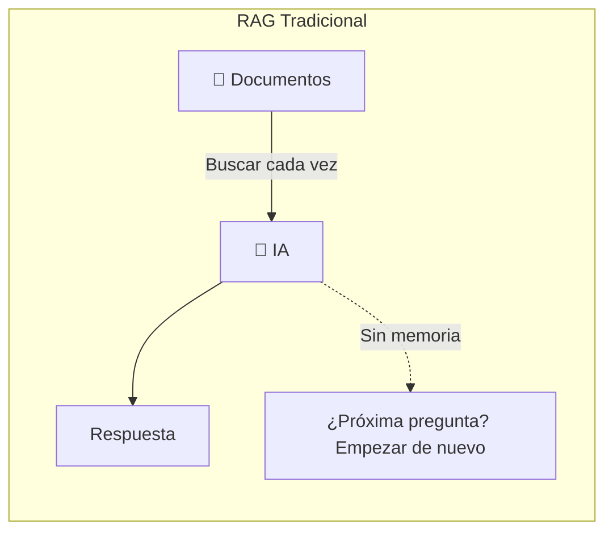
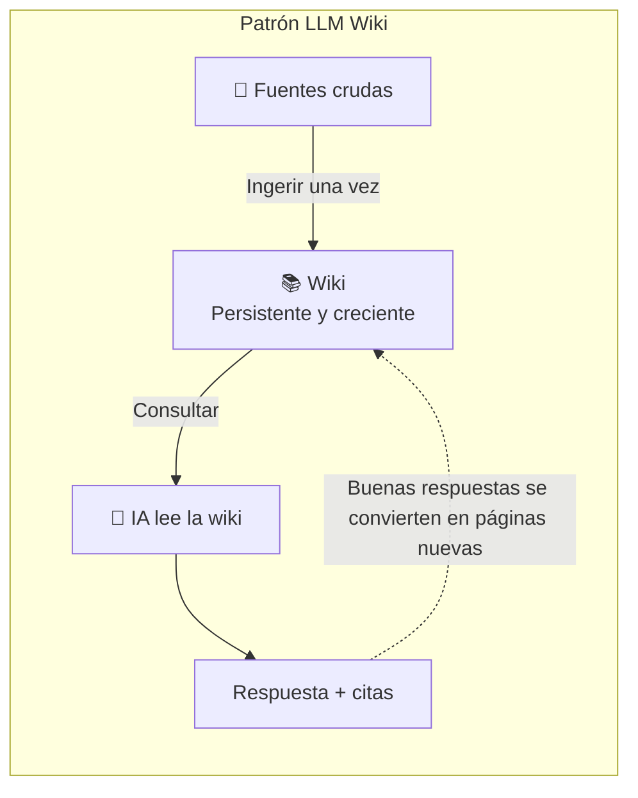
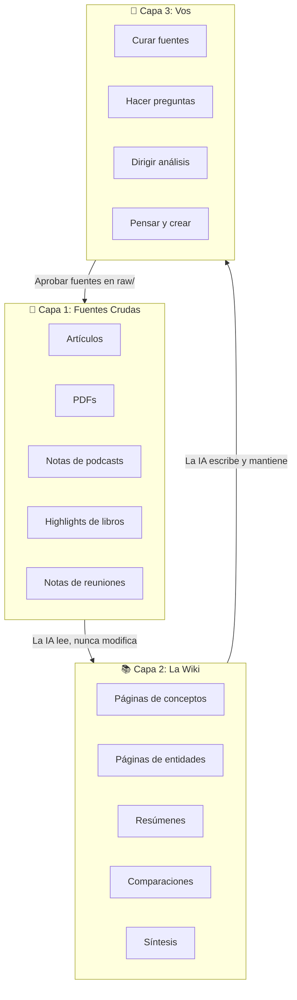
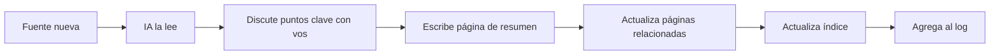
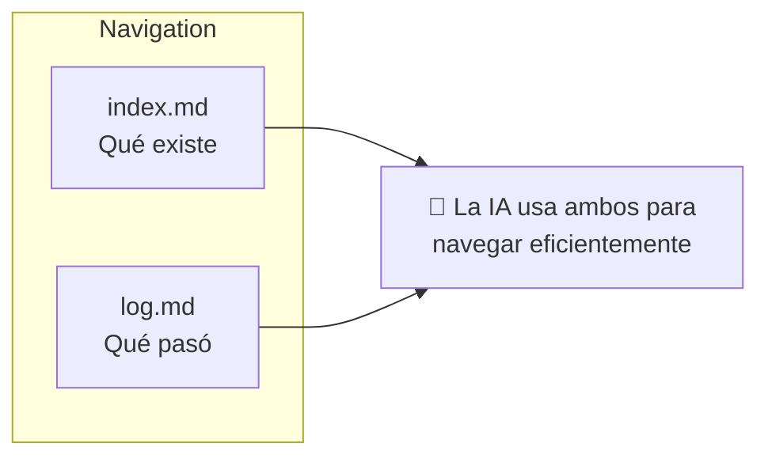
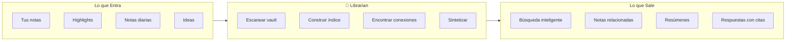
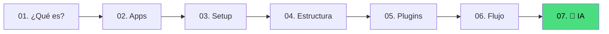

# Siguiente Nivel con IA

Tu Segundo Cerebro está funcionando. Estás capturando, organizando y creando. Si querés asistencia con IA, esta capa opcional puede hacerlo *más inteligente*.

> Esta guía es opcional. La configuración base del Segundo Cerebro de las guías 01-06 funciona sin Librarian, LLMs locales ni ninguna capa de agente.

## El Problema

A medida que tu vault crece, vas a chocar con paredes:

- **100 notas** — Todavía podés encontrar cosas manualmente
- **500 notas** — La búsqueda funciona, pero te perdés conexiones
- **1,000+ notas** — Hay oro enterrado ahí que nunca vas a ver

Acá es donde la IA puede ayudar. No para reemplazar tu pensamiento — para **augmentarlo**.

## RAG vs. LLM Wiki

Puede que ya hayas visto herramientas de IA que te dejan "chatear con tus documentos" — subís un PDF, hacés preguntas, obtenés respuestas. Eso se llama **RAG** (Retrieval-Augmented Generation). Funciona, pero tiene una limitación fundamental:

> Cada vez que hacés una pregunta, la IA empieza de cero. Nada se recuerda. Nada se acumula.



Para quienes quieren un vault asistido por agente, hay una mejor forma. Se llama el **patrón LLM Wiki**, y es la idea detrás de Librarian.

En vez de buscar documentos crudos en cada pregunta, la IA **construye y mantiene incrementalmente una wiki persistente** — una colección estructurada e interconectada de archivos markdown que se interpone entre vos y tus fuentes crudas.



La diferencia: **la wiki se acumula.** Las referencias cruzadas ya están construidas. Las contradicciones ya están marcadas. La síntesis ya refleja todo lo que leíste. Se enriquece con cada fuente que agregás y cada pregunta que hacés.

Este concepto fue articulado por [Andrej Karpathy](https://gist.github.com/karpathy/442a6bf555914893e9891c11519de94f) y es la base de lo que hace Librarian.

| RAG Tradicional | LLM Wiki (Librarian) |
|----------------|----------------------|
| Busca documentos crudos cada vez | Construye una wiki persistente y creciente |
| Redescubre el conocimiento de cero | El conocimiento se acumula y se conecta |
| Sin memoria entre preguntas | Contradicciones marcadas, conexiones mantenidas |
| Vos hacés el trabajo de conectar | La IA hace el bookkeeping |
| Las respuestas desaparecen en el historial del chat | Las buenas respuestas se convierten en páginas nuevas de la wiki |

## Cómo Funciona: Las Tres Capas

El patrón LLM Wiki opcional tiene tres capas distintas dentro de tu vault:

> **PARA organiza tu vida y tus proyectos. Librarian organiza opcionalmente la capa de conocimiento procesable por IA.** No compiten — cooperan. Tu estructura PARA sigue intacta; Librarian agrega su propia capa operativa al lado solo si elegís usarlo.



### Capa 1: Fuentes Crudas (Tu Input)

Artículos, PDFs, highlights de libros, notas de podcasts, transcripciones de reuniones — cualquier cosa de la que quieras aprender. Son **inmutables** — la IA las lee pero nunca las modifica. Esta es tu fuente de verdad.

En el vault, esta capa vive en `raw/`. `raw/` es la frontera explícita de consentimiento para procesamiento con IA: Librarian solo lee las fuentes que movés o copiás ahí. Tus carpetas PARA, `daily/` e `inbox/` quedan fuera de `raw/` como capa humana.

### Capa 2: La Wiki (El Trabajo de la IA)

Un directorio de archivos markdown que la IA crea y mantiene. Páginas de conceptos, páginas de entidades, resúmenes, comparaciones, referencias cruzadas. La IA es dueña de esta capa enteramente. Crea páginas, las actualiza cuando llegan fuentes nuevas, y mantiene todo consistente.

Librarian espera esta estructura mínima:

```text
wiki/
  index.md
  log.md
  conceptos/
  entidades/
  sources/
  synthesis/
```

**Vos la leés. La IA la escribe.**

Pensalo como una wiki de fans (ej: [Tolkien Gateway](https://tolkiengateway.net/wiki/Main_Page)) — miles de páginas interconectadas construidas durante años por voluntarios. Excepto que la IA hace todo el cross-referencing y mantenimiento en segundos.

### Capa 3: Vos (El Director)

Tu trabajo es:
- **Curar** — Decidir qué fuentes valen la pena agregar
- **Explorar** — Hacer preguntas, seguir links, perseguir ideas
- **Dirigir** — Decirle a la IA qué enfatizar, en qué profundizar
- **Pensar** — La IA maneja el bookkeeping para que te puedas concentrar en pensar

### Mapa Completo de Carpetas de Librarian

Si habilitás Librarian, las tres capas conceptuales se materializan en estas carpetas dentro de tu vault:

| Carpeta | Rol | Quién escribe |
|---------|-----|---------------|
| `1-proyectos/` | Proyectos activos con fecha límite o meta | Vos |
| `2-areas/` | Responsabilidades en curso sin fecha de fin | Vos |
| `3-recursos/` | Temas de interés | Vos |
| `4-archivo/` | Proyectos completados e ítems inactivos | Vos |
| `daily/` | Notas diarias humanas, no procesadas por Librarian por defecto | Vos |
| `inbox/` | Captura humana temporal. Librarian nunca la lee directamente. | Vos |
| `raw/` | Fuentes inmutables aprobadas explícitamente para IA | Vos |
| `wiki/` | Conocimiento ya estructurado | Librarian |
| `reviews/` | Superficie humana de revisión y export | Librarian (vos aprobás vía CLI) |
| `reports/` | Diagnósticos del vault | Librarian |
| `memory/` | Continuidad del agente entre sesiones | Librarian |
| `configs/` | Reglas explícitas de configuración | Vos |
| `.librarian/` | Estado interno: índices, propuestas, cache, locks | Librarian |

## Las Tres Operaciones

La IA realiza tres operaciones core en tu wiki:

### 1. 📥 Ingerir

Dejás una fuente nueva en tu colección cruda. La IA:



Una sola fuente puede tocar 10–15 páginas de la wiki. La IA lee el artículo, extrae ideas clave, crea páginas nuevas y actualiza las existentes — todo el cross-referencing que los humanos encontramos tedioso.

### 2. ❓ Consultar

Hacés preguntas. La IA busca en la wiki, lee las páginas relevantes y sintetiza una respuesta con citas. El insight clave:

> **Las buenas respuestas se convierten en páginas nuevas de la wiki.** Una comparación que pediste, un análisis, una conexión que descubriste — son valiosas y no deberían desaparecer en el historial del chat.

Así tus exploraciones se acumulan en la base de conocimiento, igual que las fuentes ingeridas.

### 3. 🧹 Lintear

Periódicamente, la IA hace un health-check de la wiki:

- Contradicciones entre páginas
- Claims desactualizados reemplazados por fuentes más nuevas
- Páginas huérfanas sin inbound links
- Conceptos importantes mencionados pero sin página propia
- Referencias cruzadas faltantes

Esto mantiene la wiki saludable a medida que crece. Los humanos abandonan wikis porque la carga de mantenimiento crece más rápido que el valor. La IA no se aburre.

## El Índice y el Log

Dos archivos especiales ayudan a navegar la wiki:

### 📇 index.md

Un catálogo de todo lo que hay en la wiki — cada página listada con un link, un resumen de una línea y metadatos. Organizado por categoría (conceptos, entidades, fuentes). La IA lo actualiza en cada ingesta.

Ruta esperada: `wiki/index.md`.

### 📋 log.md

Un registro cronológico de solo-agregado de qué pasó y cuándo — ingestas, consultas, pases de lint. Te da una timeline de la evolución de tu wiki.

Ruta esperada: `wiki/log.md`.



A escala moderada (~100 fuentes, cientos de páginas), este enfoque simple basado en índice funciona sorprendentemente bien — no necesitás una base de datos vectorial compleja.

## Por Qué Funciona

La parte tediosa de mantener una base de conocimiento no es la lectura ni el pensamiento — es el **bookkeeping**. Actualizar referencias cruzadas, mantener resúmenes al día, notar cuando datos nuevos contradicen claims viejos, mantener consistencia entre docenas de páginas.

> Los humanos abandonan wikis porque la carga de mantenimiento crece más rápido que el valor. La IA no se aburre, no se olvida de actualizar una referencia cruzada, y puede tocar 15 archivos en un solo pase.

El trabajo del humano es curar fuentes, dirigir el análisis, hacer buenas preguntas y pensar qué significa todo. El trabajo de la IA es todo lo demás.

Esta idea hace eco del **Memex** de Vannevar Bush (1945) — un almacén de conocimiento personal curado con senderos asociativos entre documentos. La visión de Bush era más cercana a esto que a lo que se convirtió la web. La parte que no pudo resolver era: *¿quién hace el mantenimiento?* La IA se encarga de eso.

## Conocé Librarian 🤖

**Librarian** es el agente de IA que implementa este patrón para tu vault de Obsidian.



### Privacidad Primero

- Cuando usás proveedores locales como Ollama, las notas se quedan locales. Los proveedores cloud pueden recibir fragmentos relevantes según la configuración.
- Los embeddings se generan **localmente** cuando es posible
- No se envían datos a terceros sin tu consentimiento explícito
- Tu conocimiento es tuyo — siempre

Para una configuración local-first, seguí la guía [Configurar un LLM local](../../../local-LLM/README.es.md) antes de conectar Librarian a tu vault.

### Empezando con Librarian

1. Asegurate de que tu vault esté organizado (guías 01–06)
2. Configurá un modelo local con **[Configurar un LLM local](../../../local-LLM/README.es.md)**
3. Andá al **[repositorio de Librarian](https://github.com/Agents4Life/librarian)**
4. Seguí la guía de instalación
5. Dejá que escanee tu vault
6. Empezá a preguntar

> ⚠️ Librarian está actualmente en desarrollo como repositorio separado. Revisá [github.com/Agents4Life/librarian](https://github.com/Agents4Life/librarian) para el estado actual.

## Tips para un Vault con IA

Estas prácticas hacen que tu wiki funcione mejor con IA:

| Tip | Por qué ayuda |
|-----|---------------|
| **Usá nombres de carpetas consistentes** | La IA navega tu estructura más confiablemente |
| **Mové o copiá a `raw/` las fuentes que querés curar antes de pedir curaduría** | `raw/` marca consentimiento explícito para que Librarian la procese |
| **Dejá que la IA lintee semanalmente** | Mantiene la wiki saludable sin tu esfuerzo |
| **Guardá buenas Q&A como páginas de wiki** | Tus exploraciones se acumulan con el tiempo |
| **Usá la vista de grafo de Obsidian** | Ve la forma de tu wiki — hubs, huérfanas, clusters |
| **Descargá imágenes localmente** | La IA puede referenciarlas directamente (Ctrl+Shift+D en Obsidian) |
| **Usá el Web Clipper** | Llevá artículos a tu colección cruda en un click |

## El Viaje Completo

Llegaste. Acá está todo lo que cubrimos:



Desde "¿qué es un Segundo Cerebro?" hasta "mi Segundo Cerebro tiene una wiki persistente, acumulativa y potenciada con IA". Nada mal.

## Deep Dive

¿Querés entender el patrón LLM Wiki en su forma original? Leé el [gist de Karpathy sobre LLM Wiki](https://gist.github.com/karpathy/442a6bf555914893e9891c11519de94f) — el documento fundacional que inspiró Librarian.

## Seguí Adelante

- ⭐ Dale star a este repo si te sirvió
- 🐛 ¿Encontraste un problema? [Abrí un issue](../../../issues)
- 💬 ¿Tenés preguntas? Empezá una [discusión](../../../discussions)
- 🌍 ¿Querés ayudar a traducir? ¡Los PRs son bienvenidos!

---

**Feliz pensamiento.** 🧠

[← 06 — Tu flujo de trabajo](./06-workflow.md) · [English](../en/07-next-level-with-ai.md) · [Volver arriba ↑](../../../README.es.md)
